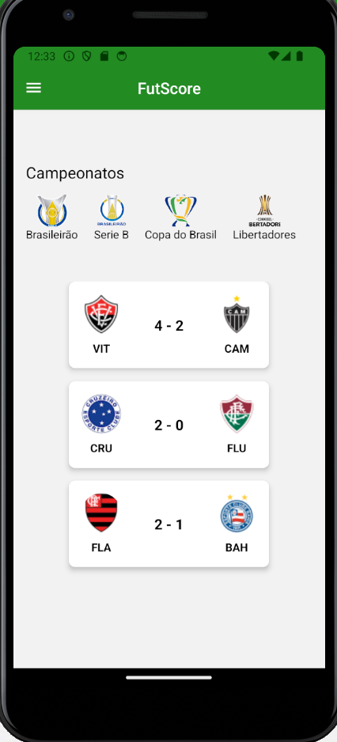

# Template padrão do app

O template criado está disponível aqui e é composto pelos seguintes
layouts:
- Cabeçalho
- Conteúdo de cada página

Todas as paginas do aplicativo são responsivas.

## Cabeçalho

O cabeçalho do app apresenta o logotipo e os botões de navegação para as diferentes páginas do app.

## Conteúdo

Essa seção será dedicada ao conteúdo de cada página. Por exemplo, na página de tabelas dos campeonatos, será exibida uma tabela do campeonato selecionado. Cada página terá um conteúdo específico relacionado ao seu propósito, como placares ao vivo, perfil, entre outros.

