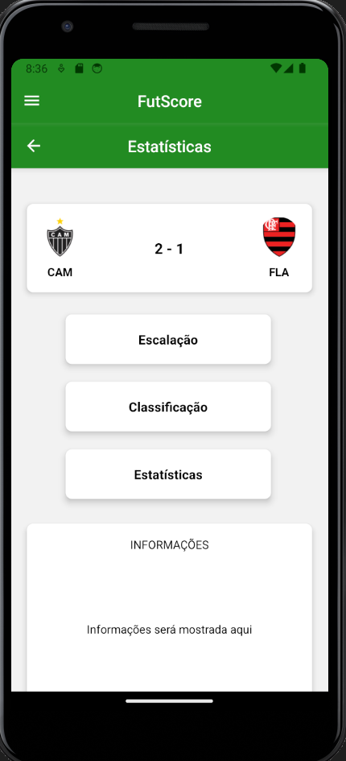
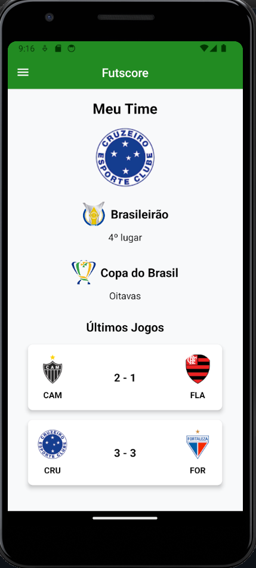
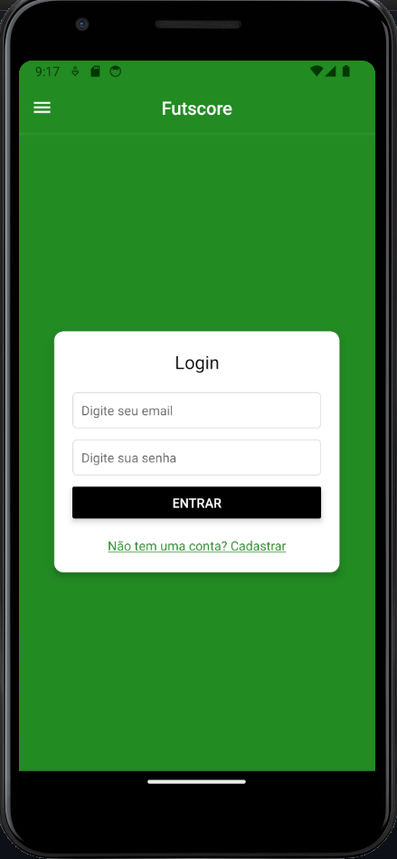
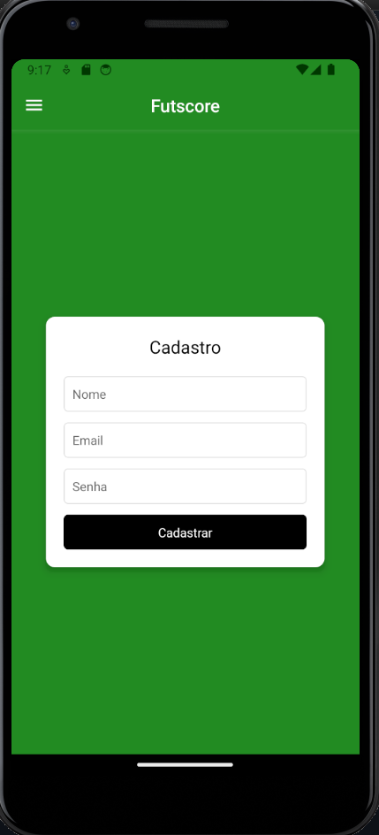
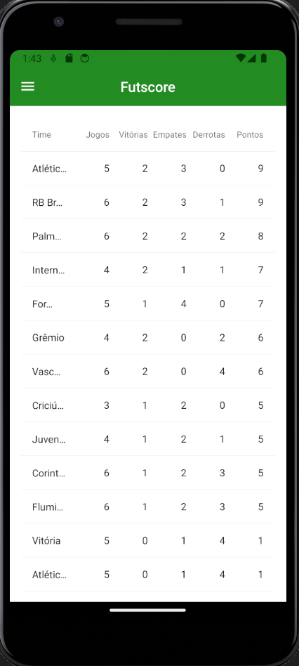

# Programação de Funcionalidades

Nesta seção são apresentadas as telas desenvolvidas para cada uma das funcionalidades do sistema. 

## 1. Homepage (RF-01)

Nesta sessão, o usuário, assim que abrir o site verá os jogos que estão acontecendo no momento.
### 1.1 Requisitos atendidos:
* RF-01 O site deve apresentar placares ao vivo de jogos de futebol.

### 1.2 Artefatos da funcionalidade:
* ../components/Campeonatos.js
* ../components/GameCard.js
* ../components/Header.js
* ./pages/Homepage.js

## 2. Estatísticas 

Nesta sessão, o usuário, assim que abrir irá conseguir ver os detalhes do jogo.
### 2.1 Requisitos atendidos:
* RF-02	O aplicativo deve exibir tabelas das competições.
* RF-03	O aplicativo deve exibir estatísticas dos jogos das competições.

### 2.2 Artefatos de Funcionnalidade:
* ../Pages/Homepage.js
* ../Pages/Estatísticas.js
* ../Components/GameCard.js
* ../Components/Campeonatos.js

## 3. Perfil

Nesta sessão, o usuário, assim que abrir irá visualizar seu perfil com seu time favorito.
### 3.1 Requisitos atendidos:
* RF-06	O aplicativo deve permitir que o usuário personalize sua página de perfil.
* RF-07	O aplicativo devera exibir informações sobre time do usuário em sua página de perfil.

### 3.2 Artefatos de Funcionnalidade:
* ../Pages/Perfil.js
* ../Components/GameCard.js
* ../Components/Campeonatos.js

## 4. Cadastro/Login 
 

Nesta sessão, o usuário, poderá se cadastrar no app, assim como logar.
### 4.1 Requisitos atendidos:
RF-05	O aplicativo deve permitir que os usuários crie sua conta

### 4.2 Artefatos de Funcionnalidade:
* ../Pages/Login.js
* ../Page/Cadastro.js

## 5. Classificação

Nesta sessão, o usuário, conseguirá ver a a classificação do campeonato.
### 5.1 Requisitos atendidos:
* RF-02	O aplicativo deve exibir tabelas das competições.

### 5.2 Artefatos de Funcionnalidade:
* ../Pages/SerieA.js

  
