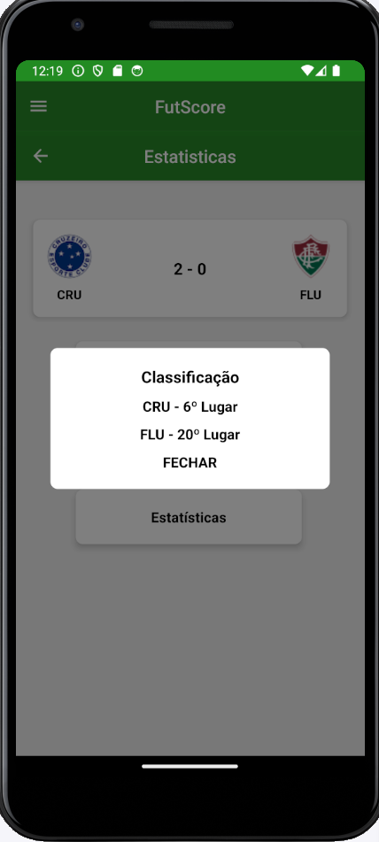
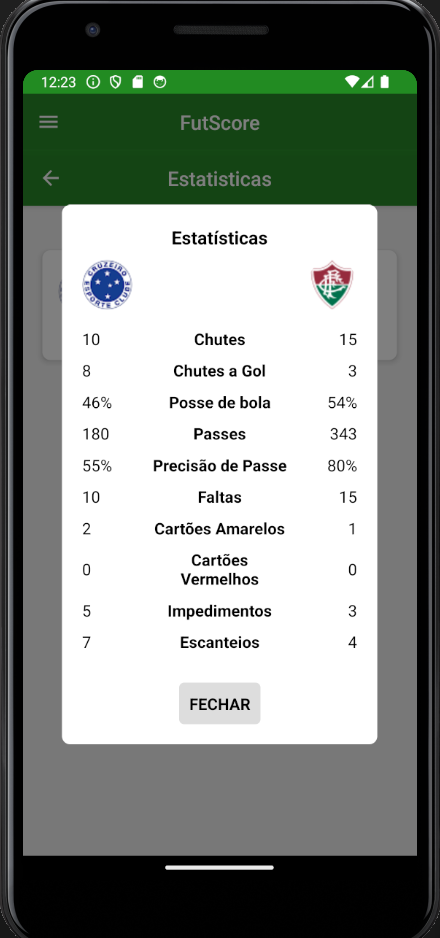
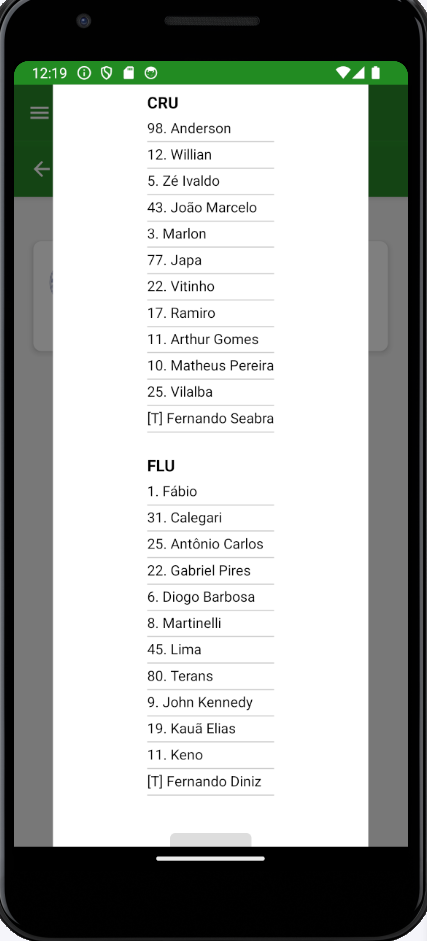

# Registro de Testes de Usabilidade

| **Caso de Teste** 	| **CT-01 – Fazer Cadastro** 	|
|:---:	|:---:	|
|	Objetivo do Teste 	| Verificar se o  usuário consegue se cadastrar de maneira satisfatória . |
| Referência 	|  |
| Avalição | - O usuário se cadastrou com sucesso |
|  	|  	|
| **Caso de Teste** 	| **CT-02 – Efetuar login**	|
| Objetivo do Teste 	| Verificar se o usuário consegue realizar login. |
| Referência 	|    |
| Avalição | - O usuário fez login com sucesso |
|  	|  	|
| **Caso de Teste** 	| **CT-03 – Acessar tabelas dos campeonatos**	|
| Objetivo do Teste 	| Verificar se o usuário consegue acessar tabela do campeonato |
| Referência 	|    |
| Avalição | - O usuário acessou a tabela com sucesso |
|  	|  	|
| **Caso de Teste** 	| **CT-04 – Acessar Dados dos jogos**	|
| Objetivo do Teste 	| Verificar se o usuário consegue acessar as informações do jogo |
| Referência 	|   |
| Avalição | - O usuário conseguiu acessar as informações com sucesso |
|  	|  	|
